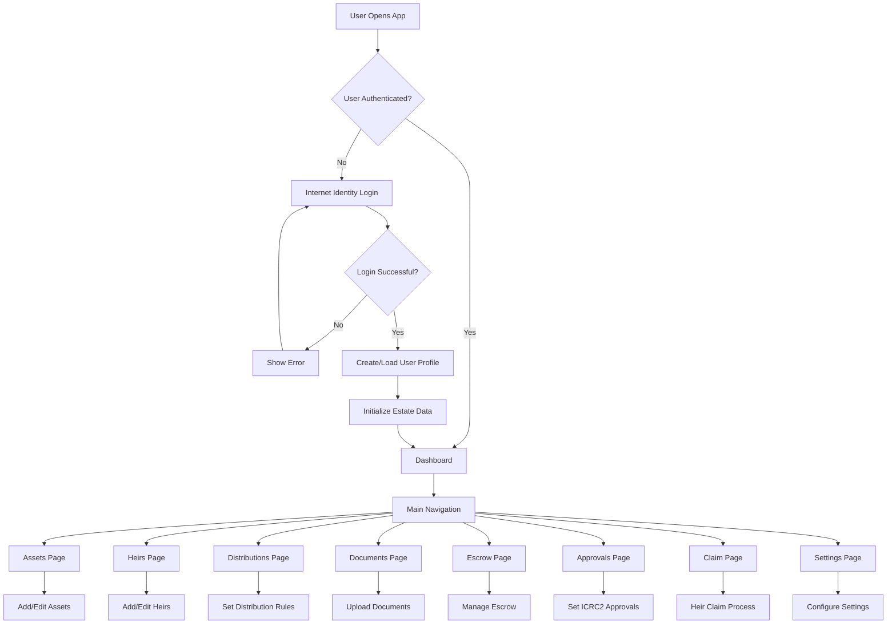
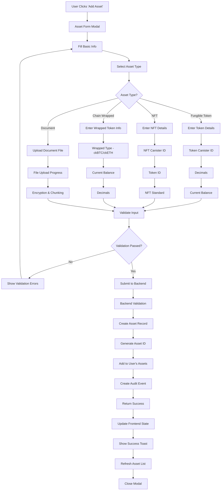
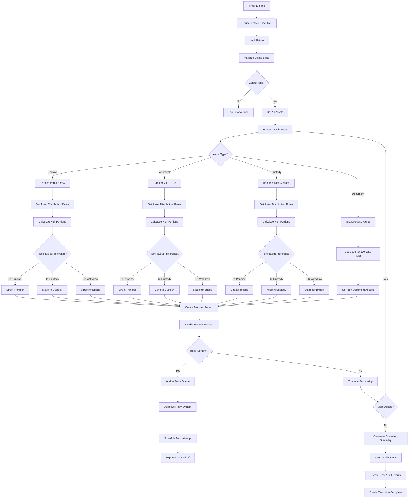
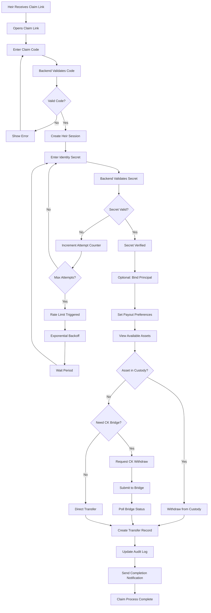
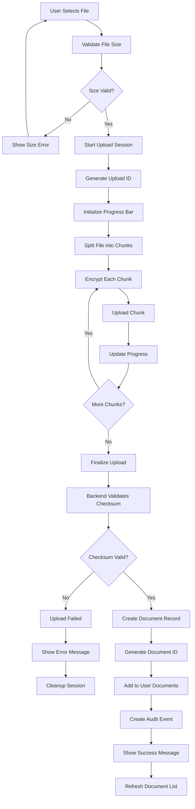
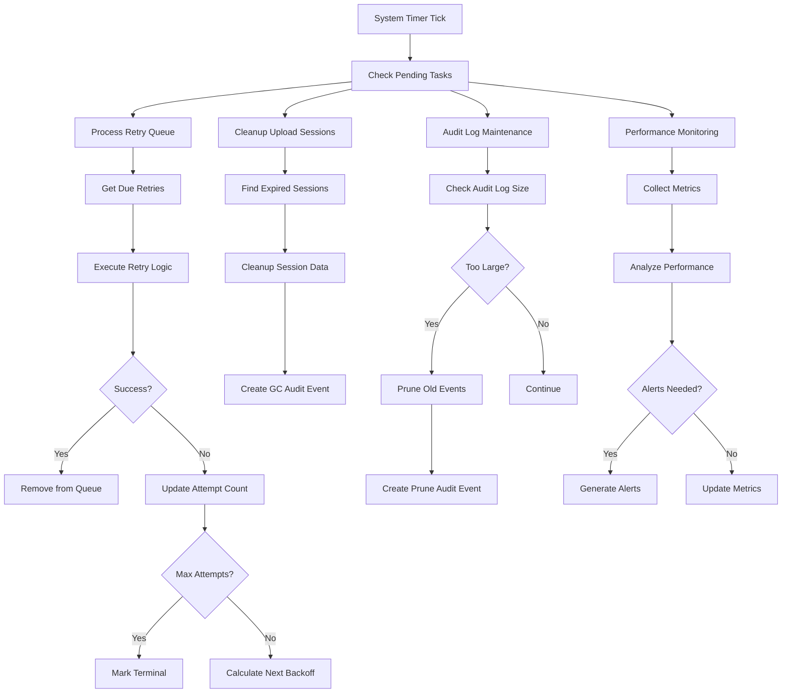
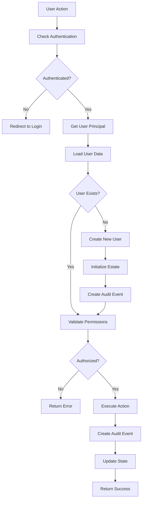
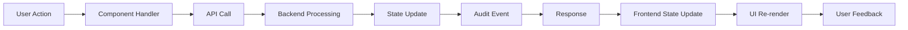

# InheritNext Application Flow Diagrams

This document provides visual flow diagrams for the InheritNext application, showing user journeys and system interactions.

## 🏁 **MAIN APPLICATION FLOW**



## 💰 **ASSET ADDITION FLOW**



## 🎯 **ASSET INHERITANCE FLOW** (Estate Execution)



## 👥 **HEIR CLAIM PROCESS FLOW**



## 📄 **DOCUMENT UPLOAD FLOW**



## ⚙️ **SYSTEM BACKGROUND PROCESSES**



## 🔐 **SECURITY & AUTH FLOW**



## 📊 **DATA FLOW ARCHITECTURE**

```
┌─────────────────┐    ┌─────────────────┐    ┌─────────────────┐
│                 │    │                 │    │                 │
│   Frontend      │    │   IC Canister   │    │   External      │
│   (React)       │    │   (Rust)        │    │   Services      │
│                 │    │                 │    │                 │
├─────────────────┤    ├─────────────────┤    ├─────────────────┤
│ • React Router  │    │ • API Modules   │    │ • ICRC1/2 Tokens│
│ • State Mgmt    │───▶│ • Storage Layer │───▶│ • NFT Canisters │
│ • UI Components │    │ • Crypto Utils  │    │ • Bridge Services│
│ • Hooks/API     │    │ • Audit System  │    │ • Email/SMS     │
│ • Type Defs     │    │ • Retry System  │    │ • Price Feeds   │
└─────────────────┘    └─────────────────┘    └─────────────────┘
         │                       │                       │
         │                       │                       │
         ▼                       ▼                       ▼
┌─────────────────┐    ┌─────────────────┐    ┌─────────────────┐
│ Internet        │    │ Stable Memory   │    │ External APIs   │
│ Identity        │    │ Storage         │    │ & Integrations  │
│ Authentication  │    │ User Data       │    │ Price Data      │
└─────────────────┘    └─────────────────┘    └─────────────────┘
```

## 🎛️ **STATE MANAGEMENT FLOW**



## 📝 **KEY INTEGRATION POINTS**

### **Frontend ↔ Backend**
- **Authentication**: Internet Identity integration
- **API Calls**: Candid interface with type safety
- **Error Handling**: Centralized error normalization
- **State Sync**: Real-time updates via polling/webhooks

### **Backend ↔ External Services**
- **Token Operations**: ICRC1/ICRC2 standard compliance
- **Bridge Services**: ckBTC/ckETH integration
- **Notifications**: Email/SMS delivery (when implemented)
- **Price Feeds**: Asset valuation services

### **Security Boundaries**
- **Principal Isolation**: Each user's data segregated
- **Crypto Operations**: Secure random generation & encryption
- **Audit Trail**: Immutable event logging
- **Rate Limiting**: Protection against abuse

---

## 🔄 **FLOW SUMMARY**

1. **User Entry**: Authentication → Profile Creation → Dashboard
2. **Asset Management**: Add Assets → Set Distributions → Configure Escrow/Approvals
3. **Heir Setup**: Add Heirs → Set Secrets → Create Claim Links
4. **Document Management**: Upload → Encrypt → Store → Index
5. **Estate Execution**: Timer Expiry → Asset Distribution → Notifications
6. **Heir Claims**: Link Access → Secret Verification → Asset Withdrawal
7. **Background**: Retry Processing → Cleanup → Monitoring → Auditing

Each flow includes comprehensive error handling, audit logging, and security validation at every step.

---

_Flow diagrams use Mermaid syntax for visualization_