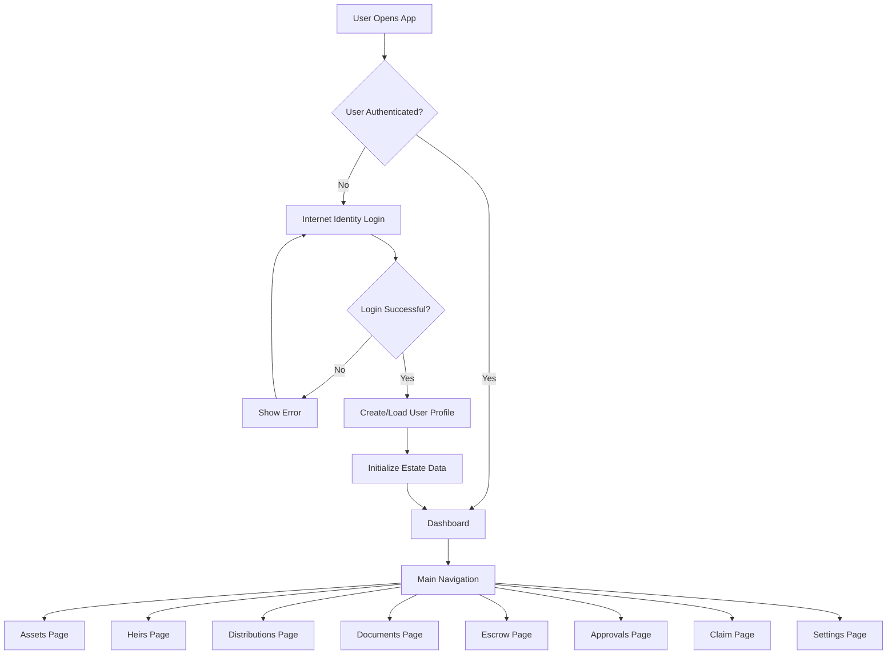

# InheritNext

InheritNext is a decentralized inheritance management system built for the Internet Computer (DFINITY). It provides secure asset registration, heir management, encrypted document storage, and automated estate execution using configurable timers and distribution rules.

This README summarizes the project, key application flows, architecture, and developer setup. For detailed visual flows, see `docs/APP FLOW.md`.

---

## Key Concepts & Features

- Decentralized backend (DFINITY canisters) with a Rust implementation for core logic and storage.
- React + TypeScript frontend (Vite) with a focused UI for asset, heir, document and escrow management.
- Timer-based estate execution that automatically processes asset distributions when conditions are met.
- Support for multiple asset types: fungible tokens (ICRC1/ICRC2), NFTs, wrapped tokens (ckBTC/ckETH), and encrypted documents.
- Heir claim flow with claim codes, session secrets, and optional principal binding.
- Robust background systems: retry processing, upload cleanup, audit log maintenance, and monitoring.
- Security-first: principal isolation, encrypted chunked uploads, immutable audit trail, and rate-limiting / backoff on sensitive flows.

---

## Quick Architecture Overview

Frontend (React) ↔ Backend (Rust canister)
- Frontend: React, TypeScript, Vite, Tailwind
  - Components: AssetsList, HeirsList, Distribution manager, Charts, Pages
  - State: React Context + hooks, centralized error normalization
- Backend: Rust canister, Candid API
  - Modules: API layer, asset/heir models, executor (timers), retry system, audit & storage

Data flow (high level)
- User actions → API call → Backend processing → State update → Audit event → Frontend re-render / notification

A concise visual of the main application flow:



For complete flow diagrams (asset addition, inheritance execution, heir claim, document upload, background processes, security), consult `docs/APP FLOW.md`.

---

## Developer Quickstart

Prerequisites
- Node.js >= 16 and npm >= 7 (project's engines)
- DFX (Internet Computer SDK) installed for local canister development and generation
- Rust toolchain (for building backend canister)

Install & run (local dev)

1. Clone repository (already done):
   ```bash
   git clone https://github.com/MrAech/InheritNext.git
   cd InheritNext
   ```

2. Install dependencies:
   - Option A: Install at repo root (workspaces)
     ```bash
     npm install
     ```
   - Option B: Or install in frontend folder:
     ```bash
     cd src/civ_frontend
     npm install
     ```

3. Setup local canister (generate types, create canister, deploy) — run from `src/civ_frontend`:
   ```bash
   npm run setup
   ```
   This script runs `npm i && dfx canister create civ_backend && dfx generate civ_backend && dfx deploy`. Ensure `dfx` is installed and initialized.

4. Start frontend (Vite dev server on port 3000):
   ```bash
   cd src/civ_frontend
   npm run start
   ```
   Open http://localhost:3000

Build
- Frontend build:
  ```bash
  cd src/civ_frontend
  npm run build
  ```
- Backend: use DFINITY / `dfx build` / Rust toolchain as required by canister build process.

Formatting
- Run Prettier formatting for frontend:
  ```bash
  cd src/civ_frontend
  npm run format
  ```

---

## Project Layout

- src/civ_backend/ — Rust backend canister source, API modules, executor, retry mechanics, models, storage.
- src/civ_frontend/ — React frontend: pages, components, context providers, hooks, and lib utilities.
- docs/ — Documentation and flow diagrams (`docs/APP FLOW.md`).
- scripts/ — utility scripts and automation helpers.

---

## Where to look for important flows (high-level)

- Asset addition and validation: frontend asset modal → backend validation → create asset record → audit event.
- Estate execution: timer expiry → lock estate → distribute assets using distribution rules and retry system for failure handling.
- Heir claim: claim link → code + secret verification → optional principal binding → withdrawal or bridge operations.
- Document uploads: chunking → encryption → backend checksum validation → storage + audit.

All of the above are diagrammed in `docs/APP FLOW.md`.

---

## Security & Auditing

- All sensitive operations generate audit events stored immutably.
- File uploads are chunked and encrypted before upload.
- Rate limiting, exponential backoff, and retry policies protect critical flows like claim secrets and bridge operations.
- Each user's data is isolated by principal.

---

## Contributing

- Follow repository coding style (TypeScript + Prettier for frontend, Rust idioms for backend).
- Run linters / formatting before submitting changes.
- Update `docs/APP FLOW.md` when flows change and keep the README high-level.

---

## License

MIT

_Last updated: August 27, 2025_
