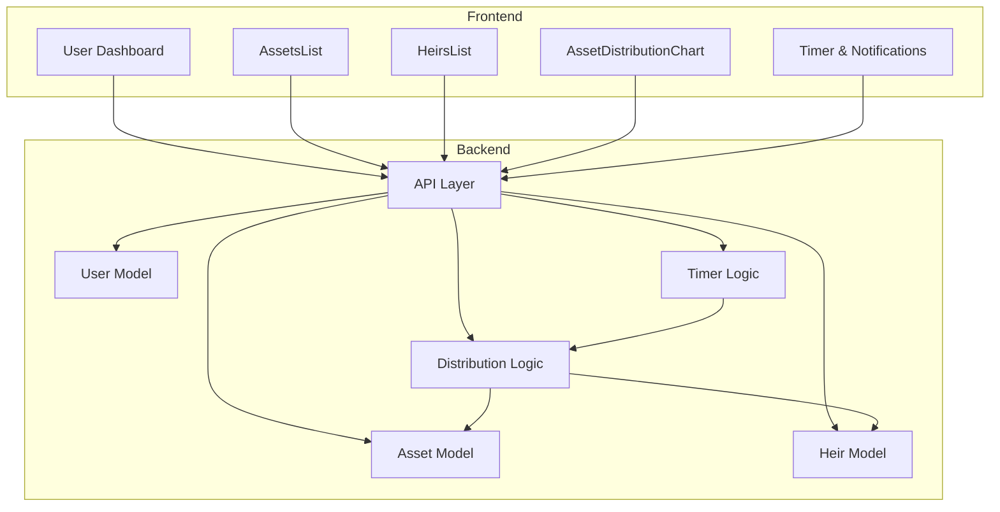

# InheritNext: Decentralized Inheritance Management System

InheritNext is a full-stack DFINITY (Internet Computer) application for secure, automated inheritance management. It enables users to register assets, assign heirs, and automate asset distribution based on customizable rules and timers.

## Architecture Diagram

## Features

- User Authentication: Secure login and session management.
- Asset Management: Add, view, update, and remove assets.
- Heir Management: Add, view, update, and remove heirs.
- Distribution Assignment: Assign asset distribution percentages to heirs.
- Access Timer: Timer starts automatically when assets are added.
- Auto Distribution: Assets are automatically distributed when timer expires.
- Dashboard: Real-time overview of assets, heirs, timer status, and distribution warnings.
- Error Handling: Robust handling of type mismatches, backend errors, and UI feedback.
- Charts & Visualization: Asset distribution charts for clear visualization.

## How It Works

1. Login and access dashboard.
2. Add assets and heirs.
3. Assign distributions.
4. Timer controls asset distribution.
5. Auto distribution on timer expiry.
6. Visualization and notifications.

## Tech Stack

- Frontend: React, TypeScript, Vite, Tailwind CSS
- Backend: Rust (DFINITY canister), Candid interface
- State Management: React Context, Hooks
- API Communication: Candid calls via frontend API layer

## Project Structure

- `src/civ_backend/`: Rust canister backend, API logic, models
- `src/civ_frontend/`: React frontend, pages, components, context, hooks

## License

MIT
